<div align="center">

# Chen Ee Heng

**Munich, Germany**

</div>

```python
class ChenEeHeng:
    """The short version. The long version is on the blog."""

    works_on   = ["computer vision", "robotics", "machine learning"]
    also_builds = ["backends", "frontends", "the infrastructure in between"]
    philosophy  = "follow a problem end to end — from the model to the metal"

    def __repr__(self) -> str:
        return "still building, still writing it all down ↓"
```

<!-- ───────────────────────────────────────────────────────────
     HIDDEN FOR NOW — delete the surrounding comment markers to
     publish. Fill in the placeholders before uncommenting.
─────────────────────────────────────────────────────────────── -->

<!--
## Featured Projects

### [Project Name](https://github.com/cheneeheng/REPO)
One-line description of what it does and why it's interesting.
`Python` · `PyTorch` · `OpenCV`

### [Project Name](https://github.com/cheneeheng/REPO)
One-line description of what it does and why it's interesting.
`C++` · `CMake` · `ROS`

### [Project Name](https://github.com/cheneeheng/REPO)
One-line description of what it does and why it's interesting.
`Django` · `PostgreSQL` · `Docker`

## Currently

- 🔭 **Building:** _what you're actively working on_
- 🌱 **Exploring:** _what you're learning or experimenting with_
-->

<div align="center">

### → I write about all of it at **[cheneeheng.github.io](https://cheneeheng.github.io)**

*Engineering notes, machine-learning deep dives, and the things I build along the way.*

[](https://cheneeheng.github.io)

<br>



<br>

[](https://www.linkedin.com/in/ee-heng-chen-dr-ing)
[](mailto:eeheng.chen@gmail.com)
[](https://cheneeheng.github.io)

<sub>Open to interesting problems and the right opportunity — a note on any of the above reaches me.</sub>

</div>